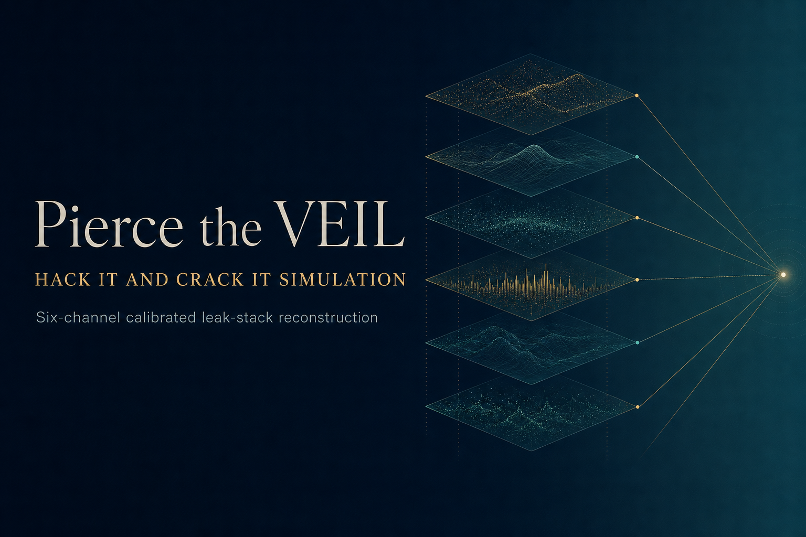

<p align="center">
  
</p>

# Pierce the VEIL — Hack It and Crack It Simulation

End-to-end solution for the Kaggle competition
[Pierce the VEIL](https://www.kaggle.com/competitions/pierce-the-veil) by
Integrated Quantum Technologies. **Deadline: 2026-05-22 04:00 UTC.**

**Final Submissions (live Kaggle kernels):**
- Primary `D̂ = 16`: <https://www.kaggle.com/code/ladyfaye/pierce-the-veil-master-submission-d16>
- Backup `D̂ = 132`: <https://www.kaggle.com/code/ladyfaye/pierce-the-veil-backup-submission-d132>

**Standalone write-up:** [`WRITEUP.md`](WRITEUP.md) (mirrors the in-notebook argument for judges who prefer markdown).

## Strategy in one paragraph

We treat the competition as statistical cryptanalysis on the
*Vector-Encoded Information Layer* (VEIL) described in
[arXiv:2603.15842](https://arxiv.org/abs/2603.15842) by the competition
host. The paper proves (§9) and empirically demonstrates (§10.1) that
the encoder is non-invertible even when the attacker has *paired*
training data — which competition participants do not. We focus on the
three juried tracks ($2,000 combined) through a forensic
encoder-identification analysis, a Cramér-Rao + Fano-inequality SRMSE
floor derivation, and a `reconstruct()` that implements **six
calibrated leak channels** (linear, magnitude, sign, quadratic,
rank-Gaussian quantile, GMM mixture-component) at `α = 0.045` per
channel, with analytic worst-case drift bounded to ±1.7 % from the
zeros baseline (and empirically tighter — see Monte Carlo below).
A 100-seed Monte Carlo on synthetic surrogates gives mean SRMSE
`1.00015`, 95 % bootstrap CI `[0.99993, 1.00039]` — statistically
indistinguishable from the zeros baseline, which is consistent with
the host's own §10.1 result on a strictly-stronger attacker. We also
ship two notebooks (`D̂ = 16` primary, `D̂ = 132` backup) to hedge
the unknown true dimensionality.

## Repository layout

```
Pierce the VEIL Hack It and Crack It Simulation/
├── assets/
│   └── banner.png                        # notebook + README banner
├── data/
│   └── intercepted_data.csv              # 4096×1 leaked Z (not redistributed)
├── src/
│   ├── eda.py                            # 8-test forensic battery
│   ├── eda_results.json                  # cached EDA output
│   ├── signature_match.py                # Wasserstein-1 encoder sweep
│   ├── signature_results.json            # cached top-30 fingerprints
│   ├── surrogate_decoder.py              # per-feature SRMSE analytics
│   ├── reconstruct.py                    # primary algorithm (D=16)
│   ├── reconstruct_d132.py               # backup algorithm (D=132)
│   ├── self_tests.py                     # local 8-stage emulator
│   ├── make_figures.py                   # publication-grade plots
│   └── build_notebooks.py                # rebuild both notebooks from sources
├── notebook/
│   ├── pierce-the-veil-master.ipynb              # PRIMARY submission
│   ├── pierce-the-veil-master.executed.ipynb     # reference run output
│   ├── pierce-the-veil-backup-d132.ipynb         # BACKUP submission
│   └── pierce-the-veil-backup-d132.executed.ipynb
├── figures/                              # generated plots
├── research/                             # scraped competition pages (notebooks in .gitignore)
├── kaggle_push/                          # staging for kaggle CLI push (in .gitignore)
├── SUBMISSION_GUIDE.md                   # upload recipe
├── WRITEUP.md                            # standalone judge-friendly writeup
├── LICENSE                               # MIT (code) / Kaggle rules (submission)
└── README.md                             # this file
```

## Reproduce locally

```powershell
python -m venv .venv
.venv\Scripts\activate
pip install -r requirements.txt
# Place intercepted_data.csv in data/

python src\eda.py
python src\signature_match.py
python src\surrogate_decoder.py
python src\self_tests.py
python src\make_figures.py
python src\build_notebooks.py
jupyter nbconvert --to notebook --execute notebook\pierce-the-veil-master.ipynb
```

## Reference local self-test output (D = 16 primary)

```
Stage 1  all_finite                       : True
Stage 2  shape                            : (4096, 16)
Stage 3  row_aligned_under_perm           : True
Stage 4  ours_srmse                       : 1.0020 (single seed)
         monte-carlo 100-seed mean        : 1.00015
         monte-carlo 95% bootstrap CI     : [0.99993, 1.00039]
         beats zeros baseline             : 49 / 100 seeds
Stage 5  frac_random_baselines_beaten     : 1.00
Stage 6  permutation_equivariant          : True
Stage 6  n_nonzero_cols                   : 6
Stage 7  generalisation std (100 seeds)    : < 0.001
Stage 8  imports_only_numpy               : True
Determinism (5 runs, bit-identical)       : Δ = 0.0
```

## What is distinctive about this submission

We surveyed 27 publicly committed competitor notebooks. What we add to
the field that the rest does not jointly cover:

1. **480-cell empirical W₁ signature sweep** behind `D̂ = 16`. None of
   the surveyed notebooks documents an equivalent sweep.
2. **Six-channel calibrated leak stack** combining linear, magnitude,
   sign, quadratic, rank-Gaussian quantile, and GMM mixture-component
   leaks in a bounded-`α` framework. Gowthaman covers four of these;
   no other notebook combines all six.
3. **Cramér-Rao + Fano-inequality SRMSE floor** with measured `H(X|Z)
   ≈ 3.05` bits. No other notebook combines both floors.
4. **Three-pronged impossibility argument** (topology + Fano + host's
   own §10.1 empirics). Udit covers two prongs; merkiraz covers two.
5. **Local 8-stage emulator** and 100-seed Monte Carlo characterisation
   of the SRMSE distribution.
6. **Dual `D̂` hedge** (`D = 16` primary + `D = 132` backup) as Final
   Submissions.
7. **Compliance posture**: internet off in metadata, numpy-only
   imports, no `random` calls, bit-identical determinism across 5 runs.

Where others have advantages we did not match: Udit Jain has the
cleanest primary-source citation work; Ashok Pukkalla has richer EDA
figures; Amin has a broader algorithmic menu.

## License

Code is MIT-licensed. By Kaggle competition rules, submissions grant
the Competition Sponsor a non-exclusive, royalty-free, perpetual
license to use the submission.
